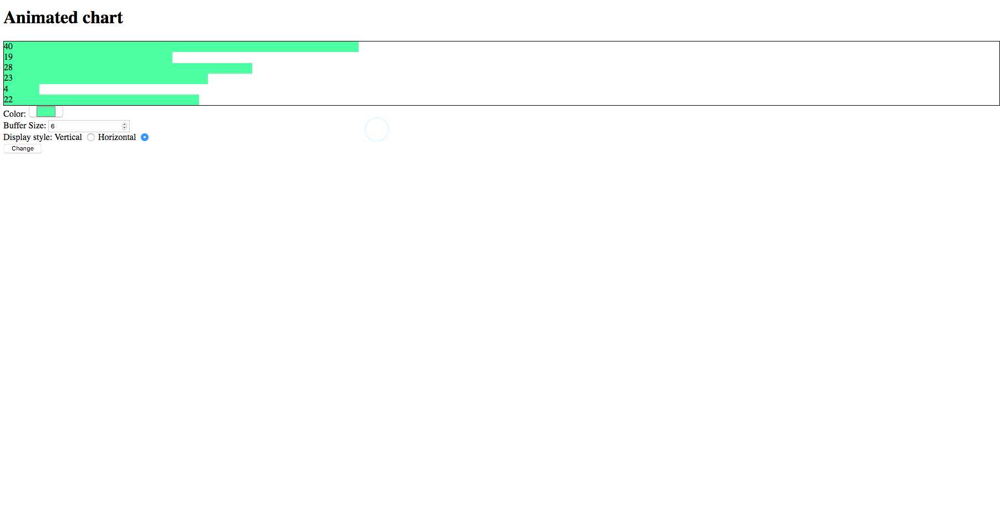

# CS 3220 Midterm

## Deliverables

* Single text containing the link to the pull request

In the pull request, it should contain the following changes:

* HTML form elements in `index.html` [2 pt]
* BufferQueue in `src/models/queue.js` [2 pts]
* GameChart WebComponent in `src/views/chart.js` [3 pts]
* tick function under `src/tick.js` [1 pt]
* event bindings in `src/app.js` [2 pts]

> Please review the `test` section below to make sure you can pass all the unit
> tests

## Context

Your mission is to implement an animated bar chart that displays
last few values in real time like gif showing below:



To do so, you will need to implement a few components -
BufferQueue data structure, the Chart web component
and a couple other utilities methods like main under app.js and tick
function under tick.js.

### Instructions

As you start hacking, you may find the midterm to be overwhelming big and
may not know where to start. It's okay to feel _overwhelmed_. A general
suggestion is to start by looking at the low level components first without
worry about combining everything all together. You should be thinking in
terms of components and how they connect to each other separately as a
Software Engineer.  For example, you may find a good start point by looking
at the BufferQueue in `src/models/queue.js` as well as the tests provided
in the `test/queue.test.js` to implement the queue.

That being said, the suggested steps is:

1. Add forms and styles under `index.html`
2. BufferQueue in `src/models/queue.js`
	1. push method
	2. setSize method
3. GameGraph in `src/views/graph.js`
	1. render method
		1. Render the bars given default values
	2. handleChange method
	3. connectedCallback method
	4. attributeChangeCallback
	5. going back to render method
		1. Change render method to take parameters from instance variable like color or style
4. tick function in `src/tick.js`
5. glue everything together in `src/app.js`

> You have find various hints and instructions under those files. Please pay
> close attentions to those comments

## Get Started

### Prerequisites

Please ensure you have the following installed prior to start coding:

* Node.js
* Text Editor
* Git

After you have Node.js installed, you want to run the following command under the
root folder of midterm:

```
npm install
```

### Build

Once you have the dependencies installed, you are ready to hack on!

To build the front end code, you can run:

```
npm run build
```

This will bundle the `src/app.js` and all files imported in the app.js to
`dest/app.bundle.js`
Then, you can import this bundled JavaScript file in your `index.html`

## Testing

To run tests, use the following commands

```
npm test
```

## Developing

Below is a list of file structure provided in the midterm starter code.
You can use the following code to better understand the overall picture.

```
[I] ✦ ➜ tree midterm
midterm
├── README.md                    --> instructions
├── demo.gif                     --> a gif showing how project should act
├── index.html                   --> the html, containing form and the chart
├── package.json                 --> meta definition about task and dependencies
├── src                          --> folder you define your source code
│   ├── app.js                   --> entry point, main method
│   ├── models                   --> business model
│   │   └── queue.js             --> buffer queue model
│   ├── tick.js                  --> ticker, should tick every second
│   ├── utils.js                 --> provided utils method to generate random value
│   └── views                    --> view components folder
│       └── chart.js             --> game chart component
├── test                         --> all unit tests
│   ├── __snapshots__
│   │   └── chart.test.js.snap
│   ├── chart.test.js
│   ├── queue.test.js
│   └── tick.test.js
└── webpack.config.js

5 directories, 15 files
```
